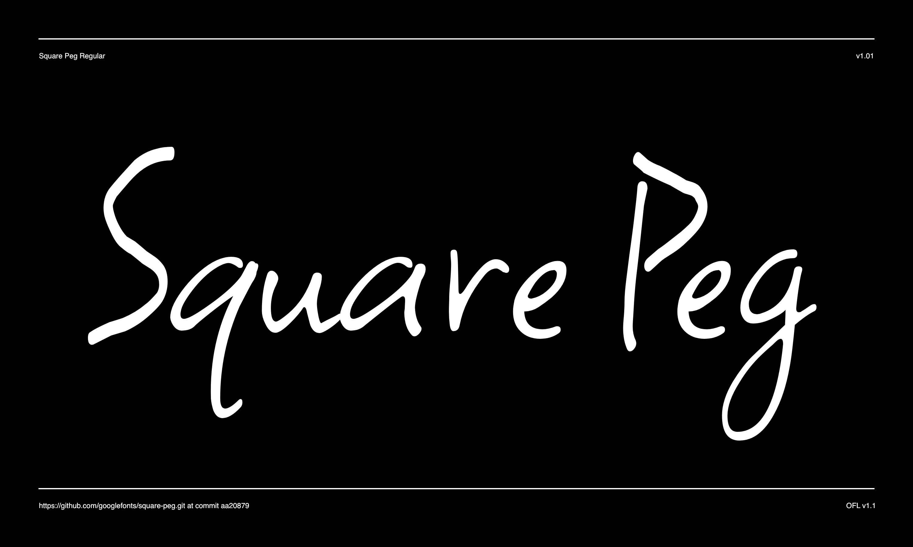

# Square Peg

This happy font is great for scrapping and casual situations. Square Peg has a shaky, rough, and almost mono-weight with slightly heavier horizontal strokes. It's hand written style lends itself to situations that require playful and casual themes.



## Building the Fonts

The font is built using fontmake and gftools post processing script. Tools are all python based, so it must be previously installed.

To install all the Python tools into a virtualenv, do the following:

From terminal:

```

cd your/local/project/directory

#once in the project folder create a virtual environment. 
This step has to be done just once, the first time:

python3 -m venv venv

#activate the virtual environment

source venv/bin/activate

#install the required dependencies

pip install -r requirements.txt

```

Then run the this command:

```
cd sources
gftools builder config.yml
```
